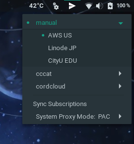

Gnome Extension Shadowsocks
===========================

My first GJS project. This project is only for learning developing Gnome extensions.

## Features

- switch ss server and change proxy mode (direct, PAC, manual) from Gnome tray
- support getting server profiles from Surge subscription link
- also supports Vmess (V2ray) via [v2socks](https://github.com/ylxdzsw/v2socks)[<sup>AUR</sup>](https://aur.archlinux.org/packages/v2socks) and v2rayN format subscription link



## Install

> for Arch users: [gnome-shell-extension-shadowsocks-git<sup>AUR</sup>](https://aur.archlinux.org/packages/gnome-shell-extension-shadowsocks-git/) is avalible in AUR.

For non-Arch users, follow the easy steps:

```sh
cd /tmp
git clone https://github.com/ylxdzsw/gnome-shell-extension-shadowsocks
mv gnome-shell-extension-shadowsocks/shadowsocks@ylxdzsw.com ~/.local/share/gnome-shell/extensions
```

Then press `Alt+F2` and enter `r` to reload, and enable it in Tweak Tool.

## Dependencies

This extension makes use of the following commands, make sure they are accessible in path.

- `sslocal` or `ss-local`: shadowsocks or shadowsocks-libev executable
- `v2socks`: to support Vmess protocol
- `xdg-open`: to open the configure directory for you
- `curl`: to sync subscription

## Configuration

This extension uses a JSON file for configuration, since it is much easier to copy and share than gsettings. This
extension reads `configs/config.json` under the its installation directory. `config.example.json` in the same folder can
be copied as a start point, which contains the descriptions of each settings and itself is valid in format (but the
server is not accessible, of course).

## Credits

Forked from [gnome-shell-extension-services-systemd](https://github.com/petres/gnome-shell-extension-services-systemd),
which is under GPLv3.

## TODO

- [ ] SSR subscription
- [ ] host local pac file
- [ ] show pings?
- [ ] show status on icon?
- [ ] allow multiple PAC/manuals, set them by ourself
- [ ] listen to config file?
- [ ] show tooltip on items in menu that display basic information of a server?
- [ ] add button for restarting?
